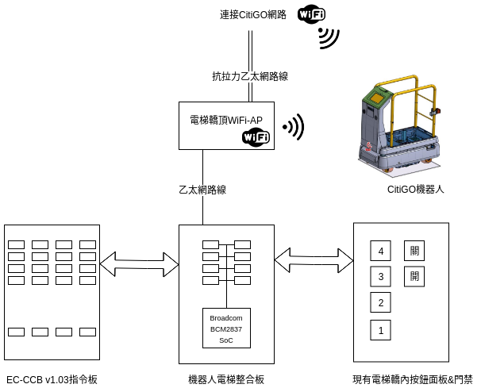
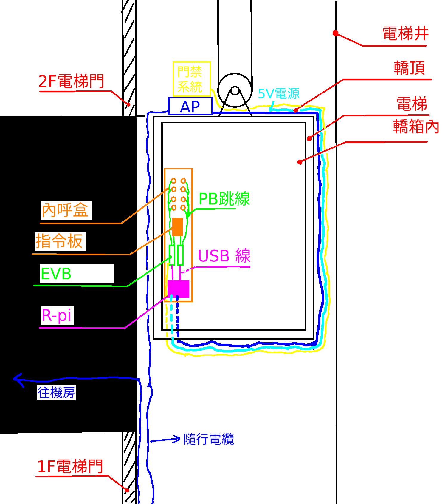
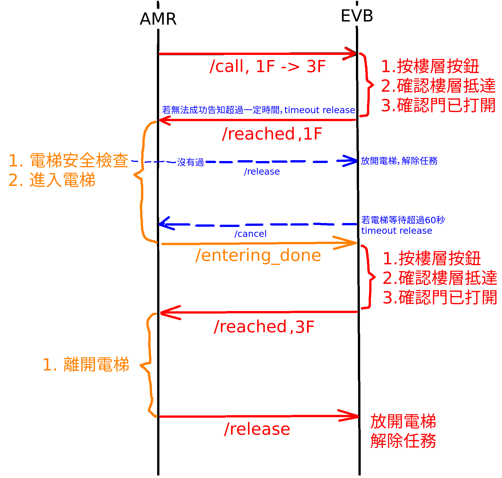
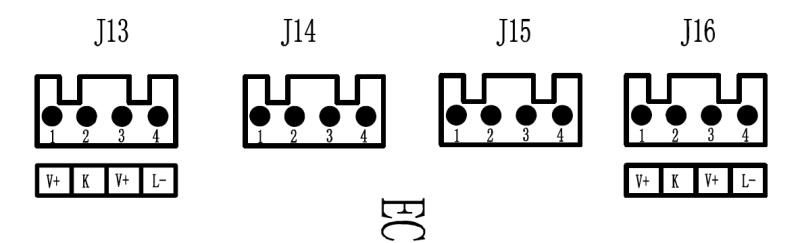
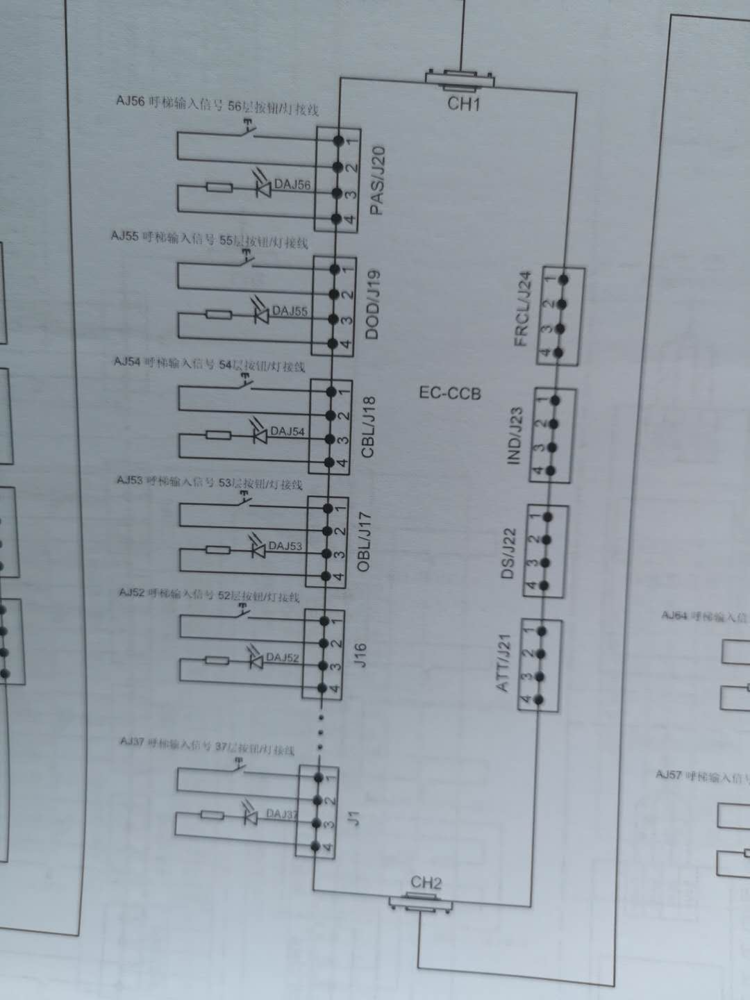
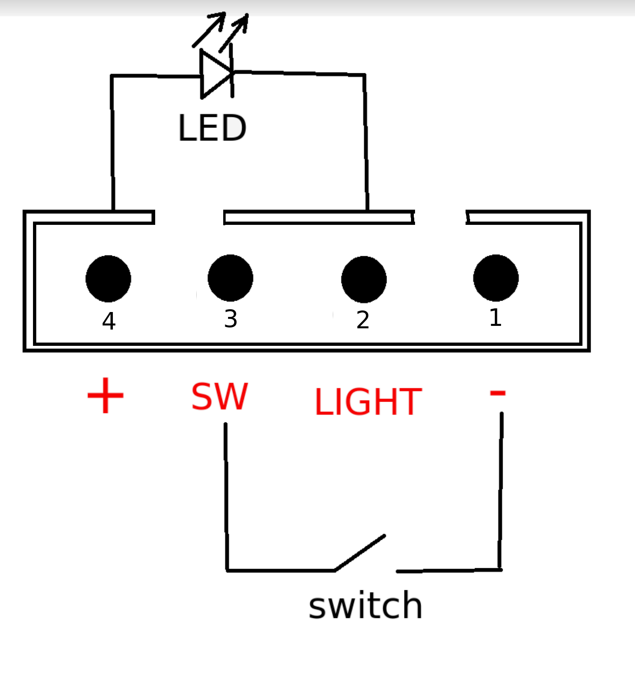

# AMR_Elevator Server Installation Instructions
## 原理圖

### 以下為浮雲電梯原理圖補充

## 通訊流程圖

## 跳線資訊
### 以下跳線資訊為北京CitiGO 上地店的


### 以下跳線資訊為台中JJP店的
#### 借由永大電機給的資訊，判斷出來的pin define ( 下圖為永大指令板的pin define )


## Prepare
### 攜帶物品列表

#### 安裝設備
|    name               | Status | Quantity | Note    | 
| --------------------  | ---    | ---      | ---     |
| Raspberry-pi3          |    | 1        | ---     |
| Raspberry-pi 外殼   |     | 1        | ---     |
| ST板(L432KC)           |   | n/7        | 取決於樓層數，建議多帶備品   |
| 電梯PCB板               |   | n/7        | 取決於樓層數，建議多帶備品  |
 
#### 安裝線材
|    name                   | Status | Quantity | Note    | 
| --------------------      | ---    | ---      | ---     |
| Etherent cable, length 3m |    | 1        | 取決於轎頂到內呼盒的距離，浮雲為8m     |
| Raspberry pi 電源供應線     |   | 1         | 5V, 2.5A以上，建議使用官方電源     |
| Micro USB, length 3m      |    | 2         | 取決於樓層數，建議多帶備品   |
| 電梯PCB跳線, 公座對母頭      |     | n/7        | 9條跳線, 6條未跳線   |
| 電梯PCB跳線, 母頭對母頭      |     | n/7        | 9條跳線, 6條未跳線   |
| 電梯PCB跳線, 杜邦頭測試線    |     | 6         | 測試用兼備品，現場佈建特別好用  |
| 電源        |    | 1         | 此項因應轎頂現有電源狀況，通常會有電源插頭，需要準備延長線   |


#### 檢測工具
|    name                   | Status | Quantity | Note    | 
| --------------------      | ---    | ---      | ---     |
| 三用電表                   | OK    | 1    | 必帶     |
| 電表探針，電表鱷魚夾         | OK    | 1    | ---     |
| HDMI 螢幕                 | OK    |  1   | 轎頂設定網路用   |
| 滑鼠 (無線佳)              | OK    | 1    | 轎頂設定網路用   |
| 鍵盤 (無線佳)              | OK    | 1    | 轎頂設定網路用   |
| USB_hub 4 port 以上       | OK    | 1    | 轎頂設定網路用  |
| 5V 行動電源                | OK | 1         | 轎頂設定網路用   |
| USB 電源測試線(杜邦端子)     | OK        | 1    | 檢測5V電源用   |
| 測試PIN腳用板                | OK   |  1   | ---   |


#### 固定組裝工具

|    name       | Status      | Quantity | Note    | 
| ------------  | ---        | ---      | ---     |
| 絕緣膠帶        | OK    | 1    |      |
| 紙膠帶          | OK    | 1    | 固定用     |
| 子母扣          | OK |  1   | 固定PCB用   |
| 剪刀            | OK    | 1    | ---   |
| 束線帶            | OK   | 1    | 固定用   |
| 麥克筆           | packing   | 1    | ---   |

## 事前準備

#### 網路
* 事先聯絡網路廠商, 綁定電梯控制板 ethernet port mac address 到 staticIP

浮雲專案請聯絡對應網路廠商

範例：以下為CitiGO北京上地店IP配置
```
電梯控制板 (wired)
ip: 192.168.64.11
mask: 255.255.240.0    (或/23)
gateway: 192.168.64.254
ns: 219.141.140.10

機器人 (WiFi)
SSID: CitiGO
ip: 192.168.64.12
mask: 255.255.240.0    (或/23)
gateway: 192.168.64.254
ns: 219.141.140.10
```

#### 程式碼
1. 確認ST32 已燒錄程式
2. 確認Raspberry-pi3 能夠開機自動開啟elevator_server且git branch 正確 (浮雲為JJP)
3. 確認Raspberry-pi3 udev_rules, 與ST 正確連接 (浮雲一共會插四塊板子，每片對應的symbolic link名稱都要對應好) 

## 現場作業 (For JJP)
### 轎頂作業
1. 跟電梯廠商簡介安裝流程，先上轎頂，拉幾條線到內呼盒，進轎內打開內呼盒跳線，最後要回轎頂做網路測試

2. 要求上轎頂，此時廠商會打開電梯門，並控制電梯到適當高度，讓大家從電梯門上的了轎頂

3. 進轎頂，先勘察環境，規劃空間，找AP，找電源，並思索現有攜帶裝備是否能成功安裝(電源通常變數較大，若無法安裝可以跟電梯師傅商量解法)

4. 拍攝轎頂AP的MAC adress給網路廠商看，並要求網路廠商進行相對應的設定

5. 安裝R-pi，接上螢幕鍵盤滑鼠，並接電源開機(若電源有疑慮可以先接杜邦測試線確認電壓)。

6. 接上AP的網路線，試著對外連線($ping 8.8.8.8 , $ping www.baidu.com.cn) ，並確定與robocall 是正常的 (若有問題反應給網路廠商)

7. [浮雲] 網路確認結束後移除R-pi

8. [浮雲] 門禁系統會接一條線出來控制(All pass)，需要確認

9. [浮雲] 轎頂上不放R-pi，但要拉三條線(電源線，網路線，門禁控制線)到內呼盒，要求電梯師傅協助施工(據說要拉8m)

### 轎內作業(內呼盒)

1. 要求電梯師傅打開內呼盒

2. [浮雲] 勘察內呼盒內部結構，檢查是否有空間擺放，四片PCB，與一片R-pi 

3. [浮雲] 將剛剛拉近內呼盒的電源線與網路線，接上R-pi，並接上螢幕鍵盤滑鼠，確認能正常開機並有網路連線

4. [浮雲] 固定R-pi 於內呼盒中，建議使用泡棉膠或子母扣，空間規劃可以參考師傅建議

5. [浮雲] 準備跳線，使用測試PIN腳用PCB，銜接一個按鈕試試看，若按下測試版上的按鈕，測試版的LED有反應，即是跳線PIN正確 (測試版跟電梯按鈕本身是並聯關係)

6. 跳線開始，過程中確保pin腳正確，每個connector都要重複檢查，一個按鈕一個鈕慢慢跳，切勿躁進

7. [浮雲] 將門禁控制線，接到PCB上

8. 固定四片PCB，建議使用泡棉膠或子母扣

9. [浮雲] 從R-pi拉四條 USB線接到PCB，確認每個ST板都有亮LED，安裝完成

### 測試
1. 跳線測試：需要確認所有剛剛接的按鈕，都可以按(導通)，也可以讀取LED亮暗
    * 先測試正常人按按鈕，電梯是否還是運作正常
    * 打開筆電
    * ./test_cmd.sh (用http 來進行測試)
    * $ w open high (按下開門鍵)
    * $ w open low  (放開開門鍵)
    * $ r open  (回傳0 or 1)
    * $ r 12     
    * 所有按鈕必須至少測試一輪
    * 若按鈕編號有誤，但功能讀寫功能正常，請直接修改param.yaml按鈕定義即可
2. 網路穩定度測試
    * 請電梯廠商將電梯回復正常模式
    * 讓R-pi一直ping robocall 
    * 呼叫電梯在1F ~ 13F 不斷來回，測試十趟
    * 最後檢查網路掉包率與延遲狀況
    * delay 應該要小於1 ms，掉包率應等於100%


## 與AMR整合測試
* 過程中需要確定開門秒數, timeout 秒數等等 (參數在param.yaml)
* 確定雙方IP與port 皆設定正確

### timeout test, 實驗timeout秒數
* 開門很久都未收到release (timeout_release)
* 移動了很久都沒有到達指定樓層 (EV not reach timeout)


