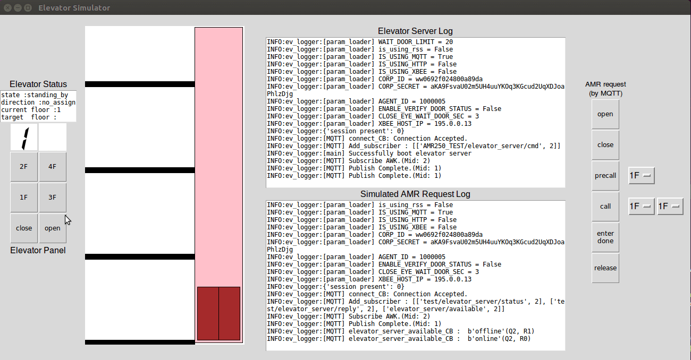
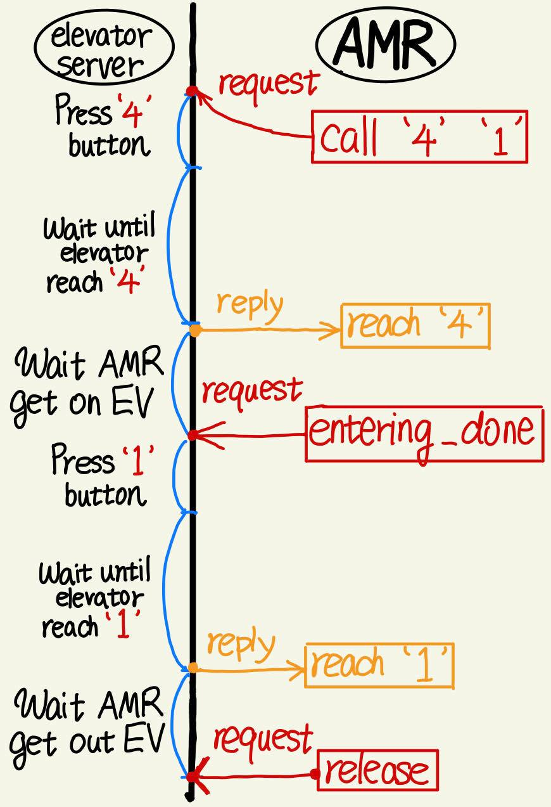
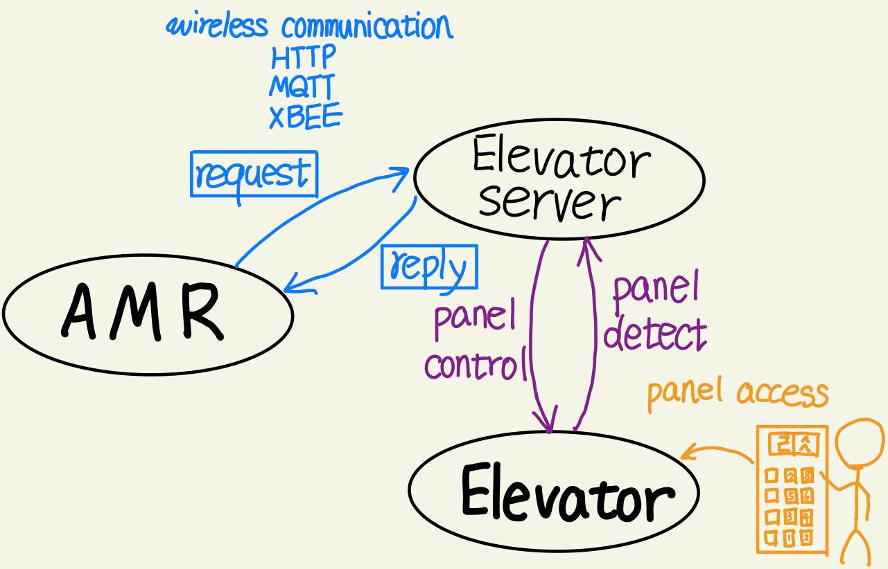

# Elevator Server

An IOT communication system that can let AMR(robot) taking elevator.

## Elevator simulation

Simulation that don't depend on elevator system and AMR. Useful tool for elevator server development.

### Prerequisite 
This simulation project is developed on Python 3.5.2

This project use public server as MQTT broker, so user's local machine must connect to internet in order to testing MQTT commmunication. 

### Running 
Execute elevator_simulator.py to start a simulation GUI

```
$ python3 elevator_simulator.py
```

GUI window will pop out.



Elevator panel on left hand side represents buttons and LED display "inside" elevator.User may toggle these buttons as acutally people pressing button in elevator.

Buttons on right hand side represent Robot(AMR) sending request to elevator server.These requests send via MQTT and receive by elevator server who can directly control elevator panel to fullfill request.
#### MQTT request type: 
```
open
```
Press **open** button on elevator panel, and don't release it until timeout.
Both **close** and **release** command can cancel this command.
```
close
```
Press **close** button on elevator panel and release **open** button if it's pressed.
```
precall '1F'
```
Press floor button on elevator panel. User can assign which floor button to press by choosing an option in the right-side listbox.
```
call 'A' 'B'
```
Initial request send by AMR(Robot). It will start a long-lasting request handler, and won't be get out of this state until **release** is called. 

Its mission is to convey AMR from A floor to B floor where 'A', 'B' can be assigned by the right-side listbox.

Elevator server will do a serial of panel opreation and detection to make sure elevator arrive is at the right floor that AMR wants and carefully treat with 'open', 'close' avoiding AMR been squeezed by elevator's door which can be caused by closing door at bad timing.

```
enter done
```
Inform elevator server that AMR(Robot) is already entered the elevator. Elevator can close the door safely now.
```
release
```
Release all the button press on elevator panel, and cancel any on-going request ("call") on elevator server.

#### Communication flow diagram 



## Files guide

### Main program 
1. **elevator_server.py**
    * Start elevator server
    * Received command from AMR.
2. **param.yaml** 
    - Parameter file, should modified this file while deployment.
3. **elevator_cmd.py** 
    - Define elevator command 
4. **notify_agent.py** 
    - Send reply/notify to AMR.
5. **cmd_struct.py**   
    - Define structure of elevator_cmd 
6. **pb_interface.py**  
    - Define interface of EVB. Directly control EVB.
7. **/global_var** - 放置至資料夾的檔案如同global variable 能被任意呼叫使用
    * **global_logger.py** - logger object
    * **global_mqtt.py**   - MQTT object
    * **global_xbee.py**   - XBEE object
    * **global_param.py**  - parameter object
8. **weixin_alarm.py** 
    - publish message to weixin alarm 
9. **autoStart.sh** 
    - 開機時，會自動被/etc/rc.local 呼叫

### For testing

1.  **test_cmd.sh** 
    - **$source test_cmd.sh**
    - HTTP通訊測試用，測試按鈕定義時，建議使用此檔案來控制按鈕
2. **fake_amr_navi_center.py** 
    - **./fake_amr_navi_center.py**
    - MQTT通訊測試用，可以透過MQTT channel與電梯板通訊
3. **xbee_fake_client.py** 
    - **./xbee_fake_client.py**
    - XBEE通訊測試用，可以透過XBEE channel與電梯板通訊


4. **elevator_simulator.py**
    - elevator IOT simulation on tk-GUI.

### Library
1. **/MQTT** 
    * **mqtt_templete.py**  
        - MQTT communication library
2. **/XBEE** 
    * **xbee_templete.py**  
        - XBEE communication library

### MCU 
1. **/L432KC_src**
    * **mcu.bin** - L432KC 的二進位檔，能直接燒錄進MCU
    * **mcu.cpp** - 上述二進位檔的src

# Usage
Execute elevator_server.py: 
```
$ sudo python elevator_server.py 
```

# Test 
### Using HTTP(curl) to test EVB
Loads http command into shell. Use these command to test http communication
```
$ source test_cmd.sh
```

### Using MQTT to test elevator_server
Create a MQTT client for testing communication.
```
$ python fake_amr_navi_center.py
```
### Using XBEE to test EVB
Create a XBEE client for testing communication.
```
$ python xbee_fake_client.py
```

# Deployment Setting

## Parameters instruction

1. **Communication parameters**

    For HTTP, assgin AMR cherrypy server ip and port. 
    ```
    AMR_URI : 'http://192.168.30.139:8080/'
    ```
    For MQTT, Assign MQTT broker's IP, and AMR client name. 
    * Note that both AMR and elevator_server must connect to the same broker ip. And usually you don't have to modified elevator_server client name.
    ```
    AMR_MQTT_NAME: ["AMR250_3"]  # TODO 
    BROKER_IP: "192.168.30.101" # Office test 
    CLIENT_NAME : "elevator_server" # [DON"T MODIFIED]
    ```
    For XBEE, Fix IP , don't have to modified.
    ```
    XBEE_HOST_IP: '195.0.0.13' # P2P
    ```
2. **PB setting** 
    
    * You must modify this part after EVB installlation 
    * Define mapping from ButtonNo to ConnectorNo
    ```
    # table = {KEY:[boardNo. ConnectorNo]}s
    table:
        'close' : [1, 1]
        'open' : [1, 2]
        '1' : [1, 3] 
        '4' : [1, 9]  
        '2' : [1, 7]  
        '3' : [1, 8]
    ```
    * Elevator server must make sure elevator arrived the floor we want it to be. Therefore,  **floor confirmation** is necessary for calling process, if you don't want AMR finally get out elevator but with a wrong floor.
    * LED state of Floor button is monitored by elevator_server
    * When elevator_server push floor button, a timer is started.
    * Once the LED turn from 'on' to 'off', it'll trigger a process that record the time  from push button to LED trun 'off'. Then push the button again, start a timer, wait for LED turn from 'on' -> 'off'... and so on.
    * This process will only be stopped when time you record match spceify patten which define below, means floor confirmation is OK.

    ```
    FLOOR_LED_CONFIRMATION_MAX_TIME : [ 2, 2 ]
    FLOOR_LED_CONFIRMATION_MIN_TIME : [ 0.5, 0.5 ]
    ```

    ```
    ENABLE_VERIFY_DOOR_STATUS: False
    CLOSE_EYE_WAIT_DOOR_SEC: 3 # sec
    ENABLE_VERIFY_DOOR_STATUS: False
    ```
    * Relate to "How you manage to confirm the door is open now?"
    * ENABLE_VERIFY_DOOR_STATUS is always False, except Shandi , because its special button-door relationship.
    * CLOSE_EYE_WAIT_DOOR_SEC means how long you wait for EV from closed-door to opend-door, since the open button is pushed. 

    ``` 
    DOOR_OPEN_LIMIT_TIME: 60.0 #sec
    ```
    * Max time that allow elevator_server keeping door open, which will make elevator LOCK by elevator_server
    ```
    WAIT_REACH_LIMIT_TIME: 300.0 #sec
    ```
    * MAX time that wait for elevator to reach assign floor.

    ```
    IS_SIMULATION: False
    ```
    * Simulator of elevator, switch to True if you want to play simulation
3. **Communication channels** 
    * Choose communicate channel, you can enable/disable any channel, but at least one channel should be set to True.
    ```
    IS_USING_MQTT: True
    IS_USING_HTTP: True
    IS_USING_XBEE: True
    ```
4. **weixin alarm setting**
    * Send a weixin message to developer's smartphone, when something goes wrong.
    ```
    is_using_rss: False 
    CORP_ID: 'ww0692f024800a89da'
    CORP_SECRET: 'aKA9FsvaU02m5UH4uuYKOq3KGcud2UqXDJoaPhlzDjg'
    AGENT_ID: 1000005
    ```

## Modify udev rule 
* Must Modifiy udev rule after connecting ST32 to R-pi. Let R-PI identify which USE port is ST32.
```
sudo vim /etc/udev/rules.d/98-st.rules
```

## ssh
* After deployment, elevator server will be installed inside the elevator, so ssh is the only way to access elevator server.
```
$ssh pi@<ip>
EX: $ssh pi@192.168.64.11 

password: odroid
```


## rc.local
Raspberry-pi 3 must automatically start elevator_server.py after rebooting.
```
$ sudo vim /etc/rc.local
```
Add lines below to /etc/rc.local

```
exec 2> /home/pi/rc.log  # send stderr from rc.local to a log file  
exec 1>&2                  # send stdout to the same log file  
set -x                     # tell sh to display commands before execution 

(sleep 10; /home/pi/elevator_gateway/autoStart.sh) &

service ssh start

exit 0
```

# Dependency 
use sudo to install pip
```
$ sudo apt-get install python-yaml (Should use pip to install)
$ sudo su 
$ pip install cherrypy
$ pip install 

# Rasbian install cherrypy
sudo apt-get install python-cherrypy3
sudo apt-get update
sudo apt-get upgrade
```
